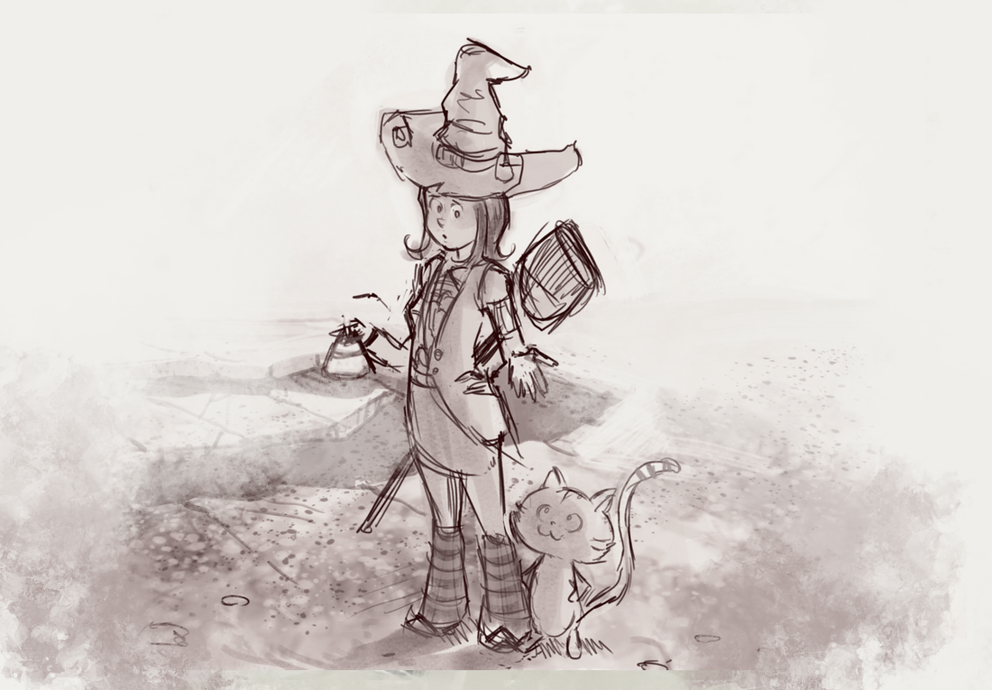

# Pepper&Carrot translation project
# Episode 06 : The Potion Contest

[http://www.peppercarrot.com](http://www.peppercarrot.com)

License
=======

[Creative Commons Attribution 3.0](https://creativecommons.org/licenses/by/3.0/)

## Translators and correctors :

* Arabic     : Mahwiii

* Català     : Juan José Segura

* Dutch      : Willem Sonke

* English    : Alex Gryson

* French     : David Revoy, corrections: Aurélien Gâteau

* German     : Alexandra Jordan, Helmar Suschka

* Italian    : Carlo Gandolfi

* Japanese   : guruguru

* Português  : Frederico Batista

* Russian    : Denis "uncle Night" Prisukhin

* Spanish    : TheFaico

* Vietnamese : Binh Pham

## Artwork :

* David Revoy, www.peppercarrot.com

## Infos :

- Documentation : Translation/Correction full how-to documentation can be read [on the official website here](http://www.peppercarrot.com/fr/article267/how-to-add-a-translation-or-a-correction).

- Lincense agreement : Authors of every translations or contributions to this project accept to release this translation work under the [CC-By license](https://creativecommons.org/licenses/by/3.0/).

- Graphics : Do not edit or propose a commit for the artwork in these repositories ( gfx_ PNG files ). Artwork here are low-resolution proxy files only. The real hi-res layered artwork, kra files, are [available here](http://www.peppercarrot.com/en/static6/sources) and are too heavy to be shared on Github. Do a modification, host them, then send me the link to them.

- Fonts : as a common resources, fonts are hosted on their own Github repository [here  github.com/Deevad/peppercarrot_fonts](https://github.com/Deevad/peppercarrot_fonts). All informations about font authors, licenses and links are managed on the README of this external repository. You can download the pack directly here : [github.com/Deevad/peppercarrot_fonts/archive/master.zip](https://github.com/Deevad/peppercarrot_fonts/archive/master.zip)
